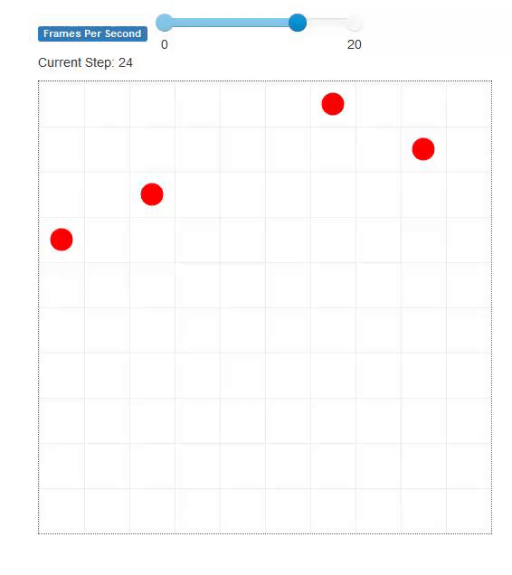
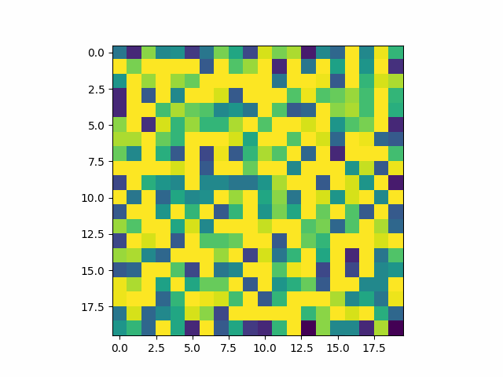

# Euthrophication
### Brandon Chin-A-Lien
## Background
Eutrophication refers to the process whereby a body of water experiences an increase in nutrients. A common consequence of this is algal bloom, the rapid increase in the growth of the algae population. This process occurs naturally, however can be sped up by human activty. Which is referred to as cultural euthrophication. This has negative effects on the ecosystem. 

We attempt to reproduce this effect in Agent Based Model. With this model we hope to reach new solutions on countering algae bloom.

Three things primarily determine dynamics of this model: Fish, Algae and Oxygen.

# Fish

Fish are agents that swim around looking for food and reproducing. They require oxygen and algae to stay alive. 

# Algae 

Algae grow each step. Algae is food for the fish and block oxygen production. 

# Oxygen

Oxygen spreads each step. Oxygen is produced by algae and breathed in by fish. 

# Dynamics

Overall the goal is to keep a balance between algae consumption and oxygen production so the fish do not die. Changing the parameters can drastically change the homeostasis of the model

